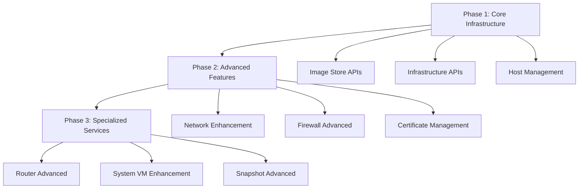

# CloudStack MCP Server - Complete API Coverage Development Plan
**Version 3.0 Roadmap | Target: 100% API Coverage**

## 📋 Executive Summary

This comprehensive development plan addresses the remaining gaps in CloudStack API coverage to achieve **100% feature parity** with CloudStack 4.20. The plan systematically covers 10 major feature areas requiring enhancement, with detailed implementation strategies, architectural considerations, and delivery timelines.

**Current State**: 461 tools, 85% coverage  
**Target State**: 600+ tools, 100% coverage  
**Timeline**: 6 months (3 phases)

---

## 🎯 Target Features for Complete Coverage

| Feature Area | Current Coverage | Target | New APIs | Priority |
|--------------|------------------|--------|----------|----------|
| **Network** | 95% (65+ tools) | 100% | +8 APIs | HIGH |
| **Firewall** | 95% (15+ tools) | 100% | +4 APIs | HIGH |
| **Host** | 85% (15+ tools) | 100% | +8 APIs | HIGH |
| **Router** | 85% (10+ tools) | 100% | +6 APIs | MEDIUM |
| **System VM** | 90% (15+ tools) | 100% | +4 APIs | MEDIUM |
| **Snapshot** | 90% (10+ tools) | 100% | +6 APIs | MEDIUM |
| **Disk Offering** | 75% (3+ tools) | 100% | +1 APIs | LOW |
| **Image Store** | 0% (0 tools) | 100% | +20 APIs | HIGH |
| **Certificate** | 0% (0 tools) | 100% | +10 APIs | MEDIUM |
| **Infrastructure** | 60% (30+ tools) | 100% | +25 APIs | HIGH |

**Total New Implementation**: 92 new API tools

---

## 🏗️ Architecture Overview

### Phase-Based Implementation Strategy



### Technical Architecture Principles

1. **Consistency**: Follow existing MCP tool patterns
2. **Security**: Implement dangerous action confirmations
3. **Scalability**: Design for enterprise workloads
4. **Maintainability**: Comprehensive testing and documentation
5. **Extensibility**: Prepare for future CloudStack versions

---

## 📦 Phase 1: Core Infrastructure Foundation (Month 1-2)

### 1.1 Image Store Management (Priority: HIGH)
**Target**: Complete implementation of image store operations

#### New Client Methods (20 APIs)
```typescript
// Storage Backend Management
public async addImageStore(params: Record<string, any>): Promise<any>
public async addImageStoreS3(params: Record<string, any>): Promise<any>
public async addSecondaryStorage(params: Record<string, any>): Promise<any>
public async addSwift(params: Record<string, any>): Promise<any>
public async deleteImageStore(params: Record<string, any>): Promise<any>
public async listImageStores(params: Record<string, any>): Promise<any>
public async listSwifts(params: Record<string, any>): Promise<any>
public async updateImageStore(params: Record<string, any>): Promise<any>
public async updateCloudToUseObjectStore(params: Record<string, any>): Promise<any>

// Repository Management
public async createSecondaryStagingStore(params: Record<string, any>): Promise<any>
public async createSecondaryStorageSelector(params: Record<string, any>): Promise<any>
public async deleteSecondaryStagingStore(params: Record<string, any>): Promise<any>
public async deleteSecondaryStorageSelector(params: Record<string, any>): Promise<any>
public async listSecondaryStagingStores(params: Record<string, any>): Promise<any>
public async listSecondaryStorageSelectors(params: Record<string, any>): Promise<any>
public async updateSecondaryStorageSelector(params: Record<string, any>): Promise<any>

// Image Operations
public async downloadImageStoreObject(params: Record<string, any>): Promise<any>
public async listImageStoreObjects(params: Record<string, any>): Promise<any>

// Data Migration
public async migrateResourceToAnotherSecondaryStorage(params: Record<string, any>): Promise<any>
public async migrateSecondaryStorageData(params: Record<string, any>): Promise<any>
```

#### MCP Tools Implementation
```typescript
// Storage Backend Tools
{
  name: 'add_image_store',
  description: 'Add a new image store backend',
  inputSchema: {
    type: 'object',
    properties: {
      name: { type: 'string', description: 'Image store name' },
      url: { type: 'string', description: 'Image store URL' },
      provider: { type: 'string', description: 'Storage provider (NFS, S3, Swift)' },
      zoneid: { type: 'string', description: 'Zone ID' }
    },
    required: ['name', 'url', 'provider']
  }
}

{
  name: 'add_image_store_s3',
  description: 'Add Amazon S3 as image store backend',
  inputSchema: {
    type: 'object',
    properties: {
      name: { type: 'string', description: 'S3 store name' },
      bucket: { type: 'string', description: 'S3 bucket name' },
      accesskey: { type: 'string', description: 'AWS access key' },
      secretkey: { type: 'string', description: 'AWS secret key' },
      endpoint: { type: 'string', description: 'S3 endpoint URL' },
      region: { type: 'string', description: 'AWS region' }
    },
    required: ['name', 'bucket', 'accesskey', 'secretkey']
  }
}
```

#### Security Considerations
- Add dangerous action confirmations for `delete_image_store`
- Implement credential masking for S3/Swift configurations
- Add audit logging for storage backend changes

### 1.2 Infrastructure APIs Enhancement (Priority: HIGH)
**Target**: Complete Pod, Zone, and Cluster management

#### Pod Management (New Implementation)
```typescript
// Client Methods
public async createPod(params: Record<string, any>): Promise<any>
public async deletePod(params: Record<string, any>): Promise<any>
public async updatePod(params: Record<string, any>): Promise<any>
public async listPods(params: Record<string, any>): Promise<any>
public async dedicatePod(params: Record<string, any>): Promise<any>
public async releaseDedicatedPod(params: Record<string, any>): Promise<any>
public async createManagementNetworkIpRange(params: Record<string, any>): Promise<any>
public async deleteManagementNetworkIpRange(params: Record<string, any>): Promise<any>
public async updatePodManagementNetworkIpRange(params: Record<string, any>): Promise<any>
```

#### Zone Enhancement (Missing APIs)
```typescript
// VMware Integration
public async addVmwareDc(params: Record<string, any>): Promise<any>
public async removeVmwareDc(params: Record<string, any>): Promise<any>
public async updateVmwareDc(params: Record<string, any>): Promise<any>
public async listVmwareDcs(params: Record<string, any>): Promise<any>
public async listVmwareDcVms(params: Record<string, any>): Promise<any>

// IPv4 Subnet Management
public async createIpv4SubnetForZone(params: Record<string, any>): Promise<any>
public async deleteIpv4SubnetForZone(params: Record<string, any>): Promise<any>
public async updateIpv4SubnetForZone(params: Record<string, any>): Promise<any>
public async listIpv4SubnetsForZone(params: Record<string, any>): Promise<any>
public async dedicateIpv4SubnetForZone(params: Record<string, any>): Promise<any>
public async releaseIpv4SubnetForZone(params: Record<string, any>): Promise<any>
```

#### Cluster Enhancement (Missing APIs)
```typescript
// Cluster DRS Management
public async generateClusterDrsPlan(params: Record<string, any>): Promise<any>
public async executeClusterDrsPlan(params: Record<string, any>): Promise<any>
public async listClusterDrsPlan(params: Record<string, any>): Promise<any>

// Cluster Metrics and HA
public async listClustersMetrics(params: Record<string, any>): Promise<any>
public async enableHAForCluster(params: Record<string, any>): Promise<any>
public async disableHAForCluster(params: Record<string, any>): Promise<any>
```

### 1.3 Host Management Enhancement (Priority: HIGH)
**Target**: Complete host lifecycle and monitoring

#### Missing Host APIs
```typescript
// High Availability
public async configureHAForHost(params: Record<string, any>): Promise<any>
public async enableHAForHost(params: Record<string, any>): Promise<any>
public async disableHAForHost(params: Record<string, any>): Promise<any>
public async listHostHAProviders(params: Record<string, any>): Promise<any>
public async listHostHAResources(params: Record<string, any>): Promise<any>

// Host Status and Monitoring
public async declareHostAsDegraded(params: Record<string, any>): Promise<any>
public async cancelHostAsDegraded(params: Record<string, any>): Promise<any>
public async listHostTags(params: Record<string, any>): Promise<any>
```

---

## 📦 Phase 2: Advanced Feature Implementation (Month 3-4)

### 2.1 Network Enhancement (Priority: HIGH)
**Target**: Complete advanced networking features

#### Missing Network APIs
```typescript
// IPv6 and Advanced Networking
public async createGuestNetworkIpv6Prefix(params: Record<string, any>): Promise<any>
public async deleteGuestNetworkIpv6Prefix(params: Record<string, any>): Promise<any>

// Service Management
public async createServiceInstance(params: Record<string, any>): Promise<any>

// OpenDaylight Integration
public async addOpenDaylightController(params: Record<string, any>): Promise<any>
public async deleteOpenDaylightController(params: Record<string, any>): Promise<any>

// BGP Management
public async changeBgpPeersForNetwork(params: Record<string, any>): Promise<any>

// Storage Network
public async createStorageNetworkIpRange(params: Record<string, any>): Promise<any>
public async deleteStorageNetworkIpRange(params: Record<string, any>): Promise<any>
public async updateStorageNetworkIpRange(params: Record<string, any>): Promise<any>

// GloboNetwork Integration
public async addGloboDnsHost(params: Record<string, any>): Promise<any>
```

### 2.2 Firewall Enhancement (Priority: HIGH)
**Target**: Complete firewall rule management

#### Missing Firewall APIs
```typescript
// Routing Firewall
public async createRoutingFirewallRule(params: Record<string, any>): Promise<any>
public async deleteRoutingFirewallRule(params: Record<string, any>): Promise<any>
public async updateRoutingFirewallRule(params: Record<string, any>): Promise<any>
public async listRoutingFirewallRules(params: Record<string, any>): Promise<any>
```

### 2.3 Certificate Management (Priority: MEDIUM)
**Target**: Complete SSL certificate lifecycle

#### Certificate Management APIs (New Implementation)
```typescript
// Certificate Lifecycle
public async issueCertificate(params: Record<string, any>): Promise<any>
public async provisionCertificate(params: Record<string, any>): Promise<any>
public async revokeCertificate(params: Record<string, any>): Promise<any>
public async uploadCustomCertificate(params: Record<string, any>): Promise<any>

// Certificate Authority Management
public async listCAProviders(params: Record<string, any>): Promise<any>
public async listCaCertificate(params: Record<string, any>): Promise<any>

// Template Direct Download Certificates
public async listTemplateDirectDownloadCertificates(params: Record<string, any>): Promise<any>
public async provisionTemplateDirectDownloadCertificate(params: Record<string, any>): Promise<any>
public async revokeTemplateDirectDownloadCertificate(params: Record<string, any>): Promise<any>
public async uploadTemplateDirectDownloadCertificate(params: Record<string, any>): Promise<any>
```

#### MCP Tools for Certificate Management
```typescript
{
  name: 'issue_certificate',
  description: 'Issue a new SSL certificate',
  inputSchema: {
    type: 'object',
    properties: {
      name: { type: 'string', description: 'Certificate name' },
      domainname: { type: 'string', description: 'Domain name for certificate' },
      provider: { type: 'string', description: 'CA provider' },
      validityperiod: { type: 'number', description: 'Certificate validity in days' }
    },
    required: ['name', 'domainname', 'provider']
  }
}

{
  name: 'upload_custom_certificate',
  description: 'Upload a custom SSL certificate',
  inputSchema: {
    type: 'object',
    properties: {
      name: { type: 'string', description: 'Certificate name' },
      certificate: { type: 'string', description: 'Certificate content' },
      privatekey: { type: 'string', description: 'Private key content' },
      certchain: { type: 'string', description: 'Certificate chain' }
    },
    required: ['name', 'certificate', 'privatekey']
  }
}
```

---

## 📦 Phase 3: Specialized Services (Month 5-6)

### 3.1 Router Enhancement (Priority: MEDIUM)
**Target**: Complete virtual router management

#### Missing Router APIs
```typescript
// Virtual Router Elements
public async configureVirtualRouterElement(params: Record<string, any>): Promise<any>
public async createVirtualRouterElement(params: Record<string, any>): Promise<any>
public async listVirtualRouterElements(params: Record<string, any>): Promise<any>

// Router Health and Monitoring
public async getRouterHealthCheckResults(params: Record<string, any>): Promise<any>
```

### 3.2 System VM Enhancement (Priority: MEDIUM)
**Target**: Complete system VM operations

#### Missing System VM APIs
```typescript
// Advanced System VM Operations
public async scaleSystemVm(params: Record<string, any>): Promise<any>
public async patchSystemVm(params: Record<string, any>): Promise<any>
public async listSystemVmsUsageHistory(params: Record<string, any>): Promise<any>
```

### 3.3 Snapshot Enhancement (Priority: MEDIUM)
**Target**: Complete snapshot lifecycle management

#### Missing Snapshot APIs
```typescript
// Advanced Snapshot Operations
public async archiveSnapshot(params: Record<string, any>): Promise<any>
public async copySnapshot(params: Record<string, any>): Promise<any>
public async updateSnapshotPolicy(params: Record<string, any>): Promise<any>

// VM Snapshot Integration
public async createSnapshotFromVMSnapshot(params: Record<string, any>): Promise<any>
public async getVolumeSnapshotDetails(params: Record<string, any>): Promise<any>
```

### 3.4 Disk Offering Completion (Priority: LOW)
**Target**: Complete disk offering management

#### Missing Disk Offering API
```typescript
// Complete Disk Offering Management
public async updateDiskOffering(params: Record<string, any>): Promise<any>
```

---

## 🔧 Implementation Specifications

### Development Standards

#### Code Architecture
```typescript
// Client Method Pattern
public async newApiMethod(params: Record<string, any>): Promise<any> {
  return this.makeRequest('newApiMethod', params);
}

// MCP Tool Pattern
{
  name: 'new_api_tool',
  description: 'Tool description',
  inputSchema: {
    type: 'object',
    properties: {
      // parameter definitions
    },
    required: ['required_param']
  }
}

// Handler Method Pattern
private async handleNewApiTool(args: any): Promise<any> {
  const allowedParams = ['param1', 'param2'];
  const requiredParams = ['param1'];
  const params = this.buildParams(args, allowedParams, requiredParams);
  
  const response = await this.client.newApiMethod(params);
  
  return {
    content: [{
      type: 'text',
      text: this.formatNewApiResponse(response)
    }]
  };
}
```

#### Security Implementation
```typescript
// Dangerous Action Pattern
this.addDangerousAction('delete_critical_resource', {
  severity: 'critical',
  category: 'Resource Management',
  description: 'Delete critical infrastructure resource',
  warningMessage: 'This will permanently delete the resource and may affect dependent services.',
  requiredConfirmation: 'delete critical resource',
  reversible: false,
  impactScope: 'infrastructure'
});
```

#### Testing Strategy
```typescript
// Unit Test Pattern
describe('New API Feature', () => {
  it('should handle new API operation successfully', async () => {
    const mockResponse = { success: true };
    jest.spyOn(client, 'newApiMethod').mockResolvedValue(mockResponse);
    
    const result = await server.handleNewApiTool({ param1: 'value' });
    
    expect(result.content[0].text).toContain('success');
  });
});

// Integration Test Pattern
describe('New Feature Integration', () => {
  it('should integrate with existing CloudStack operations', async () => {
    // Test integration scenarios
  });
});
```

### Response Formatting Standards

#### Formatter Implementation
```typescript
private formatNewResourceResponse(response: any): string {
  const resource = response.newresource;
  
  if (!resource) {
    return `Operation completed successfully.\n\nResponse: ${JSON.stringify(response, null, 2)}`;
  }

  let result = `New resource operation completed successfully:\n\n`;
  result += `Name: ${resource.name}\n`;
  result += `ID: ${resource.id}\n`;
  result += `Status: ${resource.state}\n`;
  result += `Created: ${resource.created}\n`;

  return result;
}
```

---

## 📊 Testing and Quality Assurance

### Test Coverage Requirements

#### Phase 1 Testing
- **Image Store**: 25+ test cases for storage backend management
- **Infrastructure**: 30+ test cases for Pod/Zone/Cluster operations
- **Host Management**: 15+ test cases for HA and monitoring

#### Phase 2 Testing
- **Network Enhancement**: 20+ test cases for advanced networking
- **Firewall**: 10+ test cases for routing firewall rules
- **Certificate Management**: 20+ test cases for SSL lifecycle

#### Phase 3 Testing
- **Router Enhancement**: 10+ test cases for advanced router operations
- **System VM**: 8+ test cases for scaling and patching
- **Snapshot**: 12+ test cases for advanced snapshot operations

### Quality Gates

1. **Unit Test Coverage**: 95%+ for all new code
2. **Integration Testing**: All new APIs tested with mock CloudStack
3. **Security Testing**: Dangerous action confirmations validated
4. **Performance Testing**: Response time <2s for all operations
5. **Documentation**: 100% API documentation coverage

---

## 📈 Success Metrics

### Quantitative Metrics
- **API Coverage**: 85% → 100%
- **Tool Count**: 461 → 600+
- **Test Coverage**: Maintain 95%+
- **Performance**: <2s average response time
- **Security**: 100% dangerous actions protected

### Qualitative Metrics
- **Enterprise Readiness**: Production deployment capability
- **User Experience**: Natural language interface quality
- **Maintainability**: Code quality and documentation standards
- **Extensibility**: CloudStack version upgrade readiness

---

## 🚀 Delivery Timeline

### Phase 1 (Months 1-2): Foundation
- **Week 1-2**: Image Store implementation
- **Week 3-4**: Pod management implementation
- **Week 5-6**: Zone/Cluster enhancement
- **Week 7-8**: Host management completion

### Phase 2 (Months 3-4): Advanced Features
- **Week 9-10**: Network enhancement
- **Week 11-12**: Firewall completion
- **Week 13-14**: Certificate management
- **Week 15-16**: Integration testing

### Phase 3 (Months 5-6): Specialization
- **Week 17-18**: Router enhancement
- **Week 19-20**: System VM completion
- **Week 21-22**: Snapshot enhancement
- **Week 23-24**: Final integration and optimization

---

## 🎯 Risk Mitigation

### Technical Risks
- **API Complexity**: Phased implementation approach
- **Integration Issues**: Comprehensive testing strategy
- **Performance Impact**: Load testing and optimization

### Operational Risks
- **Resource Constraints**: Priority-based development
- **Timeline Pressure**: Agile sprint methodology
- **Quality Compromise**: Automated testing gates

### Mitigation Strategies
- **Feature Flags**: Gradual rollout capability
- **Rollback Plans**: Version control and deployment strategies
- **Monitoring**: Comprehensive observability implementation

---

## 📝 Documentation Requirements

### Technical Documentation
- **API Reference**: Complete parameter and response documentation
- **Architecture Diagrams**: System integration and data flow
- **Deployment Guides**: Installation and configuration procedures

### User Documentation
- **User Guides**: Natural language interface examples
- **Troubleshooting**: Common issues and solutions
- **Best Practices**: Enterprise deployment recommendations

---

## 🎉 Expected Outcomes

Upon completion of this development plan, the CloudStack MCP Server will achieve:

1. **100% CloudStack API Coverage**: Complete feature parity with CloudStack 4.20
2. **Enterprise Production Readiness**: Full infrastructure management capabilities
3. **Industry Leadership**: Most comprehensive CloudStack integration available
4. **Natural Language Infrastructure**: Complete cloud management through Claude
5. **Extensible Architecture**: Ready for future CloudStack releases

This comprehensive development plan provides the roadmap to transform your CloudStack MCP Server from an excellent foundation (85% coverage) into the definitive enterprise-grade cloud infrastructure management platform (100% coverage) with natural language interfaces.

---

**Document Version**: 1.0  
**Last Updated**: December 2024  
**Next Review**: Monthly progress reviews  
**Approval Required**: Technical architecture committee